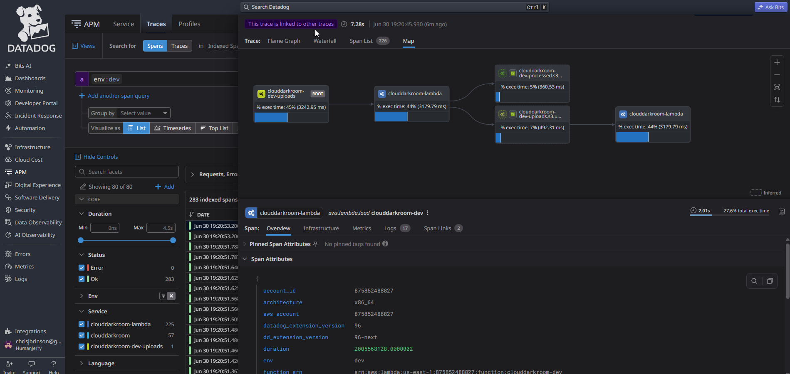
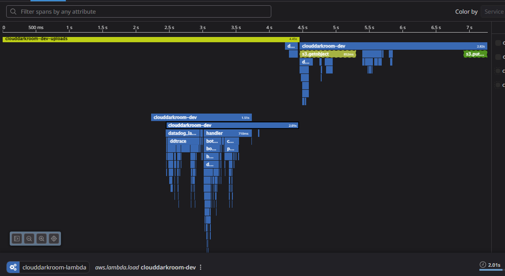

# CloudDarkroom

CloudDarkroom is an AWS project built to deepen my experience with cloud infrastructure, containerization, Infrastructure as Code, and CI/CD automation.
The end goal is to upload an image, adjust resolution, add a watermark, store metadata in a PostgreSQL DB, and automatically upload to my different artist sites(instagram, portfolio, etc.)

## Status

🚧 Active development project focused on modern cloud and platform engineering practices.

## Completed

* Terraform-managed AWS infrastructure
* Custom VPC with public and private subnets
* Amazon ECS cluster
* Amazon ECR repository
* Dockerized Python Flask application
* Remote Terraform state stored in S3
* GitHub Actions CI/CD pipeline
* OIDC authentication between GitHub and AWS
* Automated container image builds and pushes to ECR
* ECS service and task definitions
* Image upload to S3
* Lambda based image processing
* PostgreSQL database for image metadata
* Datadog for observability

## Datadog APM

## Technology Stack

* AWS
* Terraform
* Docker
* Amazon ECS
* Amazon ECR
* GitHub Actions
* Python
* Flask
* AWS Lambda
* RDS PostgreSQL DB

## Next Steps

* ~~ECS service and task definitions~~
* Application Load Balancer (not really necessary, but might implement for practice)
* ~~PostgreSQL database for image metadata~~
* ~~Image uploads to S3~~
* ~~Lambda-based image processing~~
* CloudFront CDN
* ~~Datadog for observability~~
* Upload to instagram

